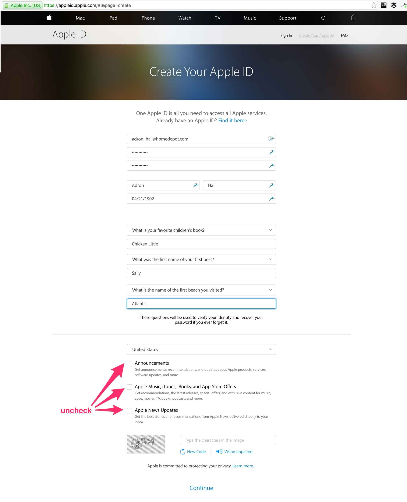
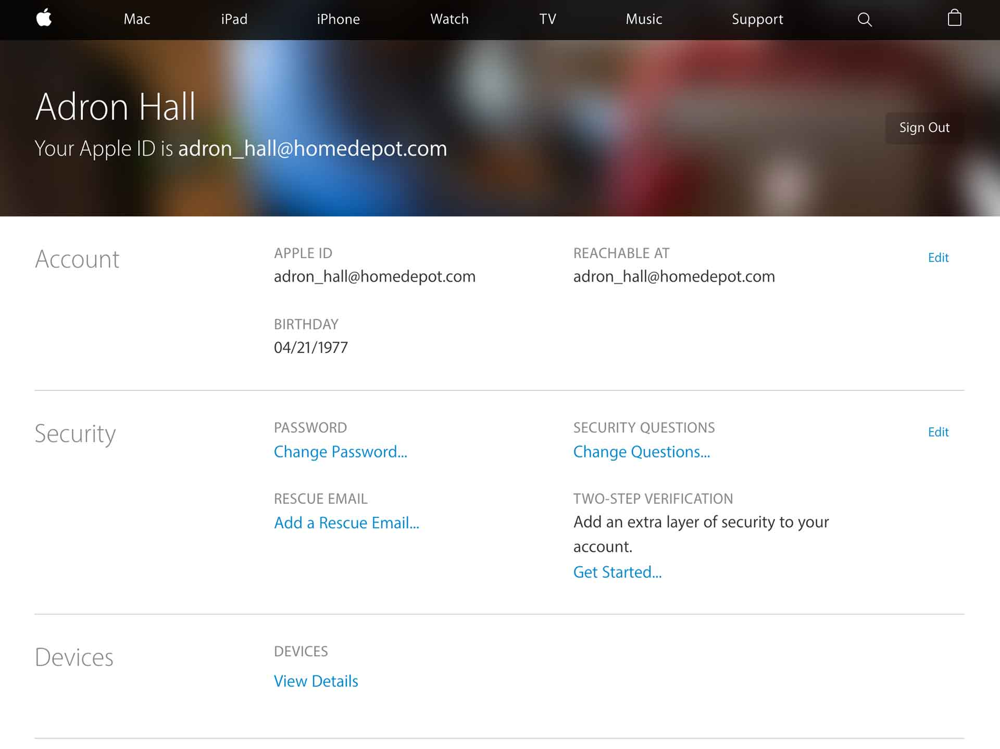

# Apple ID Registration and Sign Up

Navigate to https://appleid.apple.com/ and click on the Create Apple ID link on the page. Next fill out the form provided.

[]

Once the account is created you'll be shown a status screen as shown.

[]

Next you'll need to verify your account by logging into iTunes. On a computer with iTunes, launch the application (install it if you don't currently have access to it, it's preinstalled on any Apple product). Once iTunes is launch click on Store > Sing In on the menu bar.

There fill out the information shown on this form and click continue.

[]

All done, now you're all set. Return to the main [docs readme](../README.md).