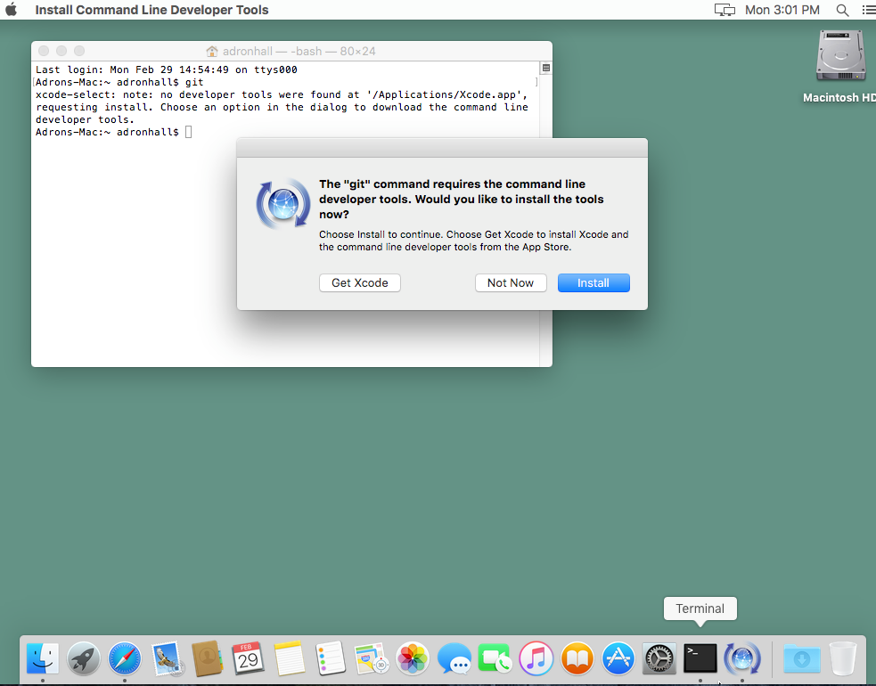

# Getting Started

To kick off all of the things you'll need as a developer open up the terminal on your newly received OS-X Machine. Next, click the Apple Command button combined with the space bar. That's ⌘+space bar and then type in "terminal". That will open up the Terminal, and then type in "git".

This will initiate the command line developer tools installation. Follow the prompts.

[]

[]

Once those steps are complete type "git" at the terminal again. This time you'll see something like this.

[]

Next clone this repository with the following command.

		git clone 